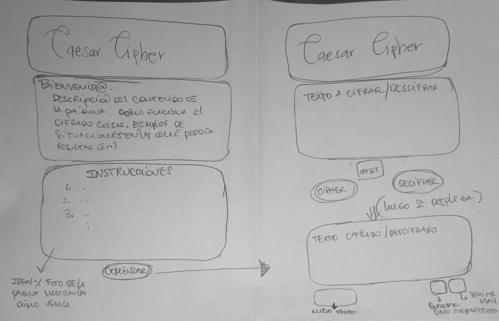
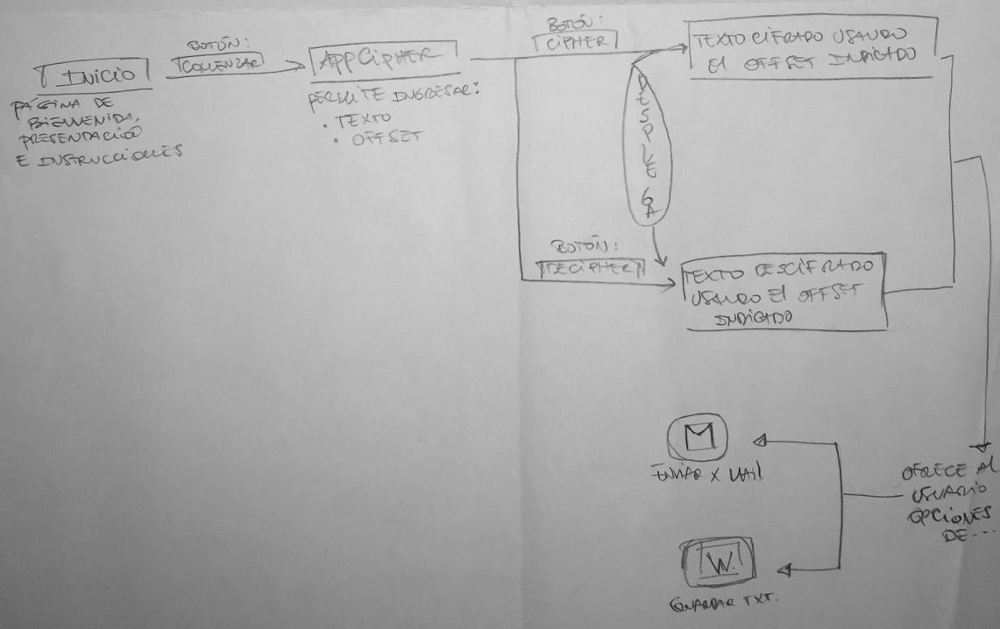
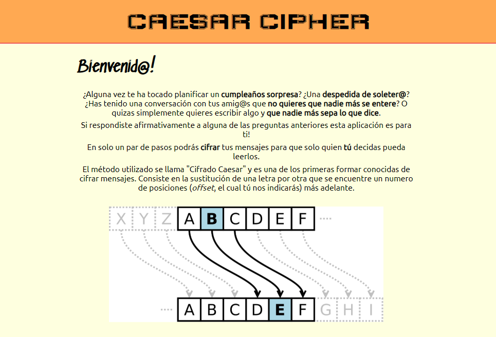
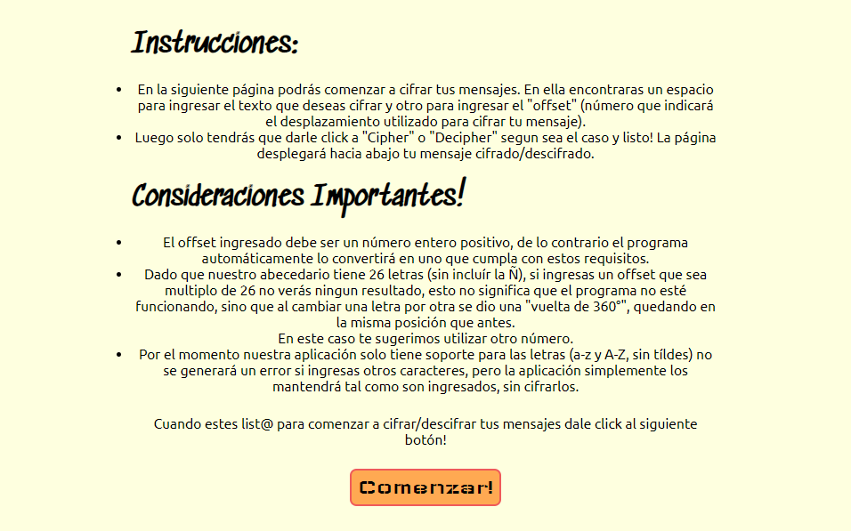
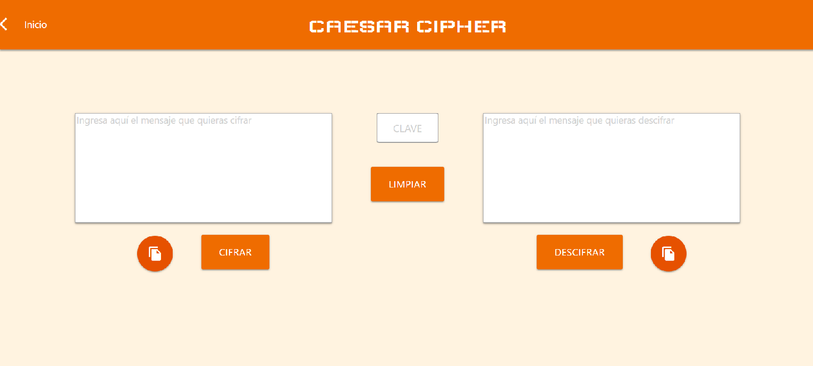

# 
¿Alguna vez te ha tocado planificar un 🎂**cumpleaños sorpresa**🎂? ¿Una 💅**despedida de soltera/o**🍸? ¿Has tenido una conversación con tus amig@s que **no quieres que nadie más se entere**🙈🙉🙊? O quizas simplemente quieres escribir algo y **que nadie más sepa lo que dice**🈲.

Si respondiste afirmativamente a alguna de las preguntas anteriores esta aplicación
es para ti!

En solo un par de pasos podrás **cifrar** tus mensajes para que solo quien **tú** decidas pueda leerlos.

**CAESAR CIPHER** es una página que permite cifrar mensajes utilizando una "clave de cifrado" (llamada offset o desplazamiento), que mueve las letras y caractéres(#$%@, etc) un determinado número de posiciones.

Por ejemplo:

- Ciframos la frase "Hola Mundo" con una clave de 5, se vería así: "Mtqf Rzsit".

El producto esta enfocado a solucionar las necesidades que las personas pudieran tener al momento de querer esconder cierta información o de querer comunicarse con un grupo reducido de personas sin riesgo de que alguien más pueda leerlos.

El usuario de Caesar Cipher es una persona socialmente activa, que quiere coordinar un evento sorpresa para alguno de sus amigos; o bien quiere guardar una cierta información para si mismos, oculta de ojos curiosos. El rango etario puede variar, siendo esta aplicación útil tanto para jovenes como para personas mayores que tengan a lo menos un manejo de nivel usuario de un computador.

# HISTORIAS DE USUARIO

## MARIA Y LA FIESTA DE CUMPLEAÑOS SORPRESA
María (25) quiere organizar una fiesta de cumpleaños sorpresa para su mejor amiga, Andrea. Con sus amigas tienen poco tiempo para juntarse, ya que tienen distintos horarios, por eso se comunican principalmente por redes sociales (facebook, twitter, instagram, whatsapp, etc). Andrea vive con otras dos amigas, con quienes María está coordinando el cumpleaños sorpresa y las probabilidades de que se tope con el computador abierto de alguna o vea cuando reciben un mensaje es alta.

Para poder planear todo con tranquilidad, María decide cifrar sus mensajes antes de enviarlos, se pone de acuerdo con sus amigas para usar de clave el número "324", ya que el cumpleaños de Andrea es el 24 de marzo, será un número facil de recordar para todas. María ingresa a la página de **Caesar Cipher** y cifra la invitación al cumpleaños de Andrea, luego la envia por una cadena de e-mails a todos los invitados, pidiendoles que respondan a ella, avisando si asistirán y qué cosas llevarán.

## PABLO Y LA DESPEDIDA DE SOLTERO
El mejor amigo de Pablo (36), Mario, se va a casar y le pidió que sea su padrino. Pablo quiere organizar la mejor despedida de soltero de la historia, pero teme que Laura, la novia de Mario, y quien suele revisarle el celular, vea los mensajes y se enoje con él.

Pablo cifra sus mensajes usando **Caesar Cipher** y luego los envía por WhatsApp, usando la aplicación web, al grupo de amigos con quien está coordinando la despedida de soltero, entre todos deciden que la clave que usarán para cifrar sus mensajes será el número "2034", el cual es el número de dirección del local que usarán para la calebración.

## CLAUDIA Y SU DIARIO DE VIDA
Claudia (15), tiene la costumbre de escribir todas las cosas importantes que le pasan en su diario de vida. Ultimamente su mamá, quien dice no entenderla, ha comenzado a leer su diario en las horas en que Claudia no está en la casa.

Claudia ha optado por llevar ahora un diario virtual en su computador, cada vez que quiere agregar algo importante a él ingresa a **Caesar Cipher**, cifra su mensaje utilizando la fecha como clave, y luego agrega el mensaje cifrado a un archivo de texto en su computador.

# DISEÑO DEL PRODUCTO

## FASE DE PLANIFICACIÓN

Para planificar el diseño de la aplicación en primer lugar se dividió el uso de la página en pequeñas tareas a realizar desde la perspectiva del usuario y que reflejaban una suerte de pasos a seguir. Luego a cada una de ellas se les asignó un *checklist* que contenía, a grandes razgos, lo que debía crearse (tanto en la página misma como en el JS) para que cada tarea pudiera ser completada. Se agregaron algunos puntos opcionales a realizar a ser evaluados durante el proceso de desarrollo. Finalmente se asignó a cada tarea una prioridad (proporcional al impacto que tendría en la aplicación) y una dificultad (aproximada y estimativa del tiempo que requeriría para ser desarrollada e implementada).

Colores por dificultad:
- Amarillo: facil a mediana.
- Naranjo: mediana a dificil.

Colores por prioridad:
- Morado: tareas prioritarias, la esencia del proyecto.
- Azul: funcionalidades adicionales, a ser implementades en caso que existiera tiempo disponible.

Todo lo anterior fué coordinado usando la página web de Trello.

[PLANIFICACIÓN CAESAR CIPHER](https://trello.com/b/Yj5YxfeZ/caesar-cipher)

## DISEÑO INICIAL

Se realizó en un primer momento un boceto en papel de como debería lucir la aplicación web: 

También un diagrama de flujo que mostraba la interacción de la página: 

Ambos sirvieron para desarrollar el *Diseño Inicial*.

El **diseño inicial** del producto buscaba tener colores calidos pero relativamente neutros que acogieran a todo tipo de usuarios. El tipo de letra usado para el header de la página busca evocar en el usuario el cifrado en sí.
En la página inicial se describía el producto y como funcionaba, buscando que quien entrara a la aplicación pudiera entender su funcionamiento antes de usarla.

>*En el diseño inicial todo el estilo de la página fue dado usando CSS puro, sin ningun Framework.*

**Inicialmente la aplicación solo podía cifrar letras, mayúsculas o minúsculas, sin acentuación, y sin la letra ñ/Ñ**. El usuario era advertido de estas circunstancias en la página inicial. Tambien se le advertía sobre el el uso de números multiplos de 26 como clave de cifrado, lo cual no desplegaría ningun resultado en su mensaje cifrado ya que el programa al cambiar la posición de la letra volvería a quedar donde ella misma se posicionaba. Todo lo anterior era advertido al usuario mediante una sección de *Consideraciones Importantes*.

Luego de que el usuario presionaba el botón **"Comenzar"** accedía a la página que permitía el cifrado de mensajes. Esta contenía una caja para ingresar el mensaje que la persona quería cifrar o descifrar, y una caja para ingresar el offset. Luego, el usuario tenía la opción de presionar el boton de "Cifrar" o "Descifrar" lo cual generaba que se desplegara hacía abajo una caja que contenía el mensaje cifrado o descifrado, según el botón que se hubiera presionado.

Los botones de cifrado y descifrado, así como la casilla del offset o desplazamiento estaban nombradas en ingles ("Cipher", "Decipher" y "offset", respectivamente)

## PRIMERA FASE DE TESTEO 

El diseño inicial del producto fué testeado con 3 personas que nunca habían visto la página y que no tenían información previa sobre su diseño o lo que hacía la aplicación. Los comentarios recibidos fueron, en lo esencial, los siguientes:

- La página inicial contiene demasiado texto, lo cual hace que quien la usa no quiera leer todo, y a causa de eso al momento de usar la aplicación no sabe bien como manejarla.
- En la página inicial, el botón "Comenzar" (que lleva a la aplicación), está posicionado al final de la página, hay que hacer scroll para llegar a él, esto dificulta el acceso a la aplicación ya que, para quien esté usando la aplicación de forma recurrente no es necesario leer las instrucciones nuevamente.
- En la página de cifrado, es poco cómodo que la página de resultado se despliegue hacia abajo y que quien la usa tenga que bajar para poder verlo, y luego subir nuevamente si quiere cifrar o descifrar otro mensaje.
- 2 de las 3 personas con las que se realizó el testing sugirieron un diseño similar al de Google Translator, con dos cajas, una al lado de la otra, en donde se cifrara y descifrara de forma cruzada.
- Las personas con quien se realizó el testing oresentaron dificultades para entender por qué el los números multiplos de 26 no cifraban. También encontraron innecesaria esa información, les bastaría saber que debian ingresar otro número.
- 1 de las personas con las que se realizó el testing presentó dificultades al momento de identificar el "offset" y entender su funcionalidad, asi como para entender que hacía cada botón. Según señaló, esto ocurrió debido a que los nombres de los botones estaban en ingles, de igual forma la palabra "offset" le pareció poco descriptiva y sugirió utilizar algo como "código" o "clave" para renombrarla.

## SEGUNDO DISEÑO

El segundo diseño trató de abordar la mayoría de los problemas planteados por los usuarios en la primera fase de testeo.

Para hacer la página más amigable al usuario se amplió la covertura de la aplicación para que cifre ñ/Ñ, acentos y caractéres especiales, gracias a esto fue posible eliminar la sección de consideraciones importantes (en la que se advertía al usuario sobre no usar estos caractéres) de la página inicial. En conjunto con lo anterior se redujo todo el contenido de la página inicial para que el usuario no tuviera que hacer scroll en ella, sino que a penas ingresara a ella viera todo su contenido. Se creó una barra de navegación en la parte superior de la página y se colocó en ella el boton de comenzar para que fuera de facil acceso al usuario.

>*En el segundo diseño se dió estilo a la página utilizando [Materialize](https://materializecss.com/).*

En la página de cifrado, se renombraron los botones a "Cifrar" y "Descifrar" y a la caja para ingresar el "offset" se le puso el nombre de "clave" para que el usuario pudiera entender su utilidad más facilmente. Se colocaron 2 cajas para ingresar texto, en una se ingresa el texto que el usuario quiere cifrar y en la otra el texto que el usuario quiere descifrar, al medio se posiciona la caja para ingresar la clave. El texto cifrado se posiciona en la caja de texto a descifrar y viceversa.

Se adicionó un boton de volver en la barra de navegación para que el usuario pueda volver a ver las instrucciones si lo estima necesario. Se agregaron botones para que se pueda copiar el texto cifrado o descifrado con un solo click. También se adicionó un boton que limpia todas las cajas de texto de la página, la deja limpia para ser usada nuevamente.

En cuanto a la interacción del usuario con la aplicación, se habilitó que funcionara al presionar "enter" igual que como si se presionara el botón de "Cifrar" o "Descifrar", y se habilitó Shift+Enter para que cumpliera la función de saltar linea. Se dejó un único alert, para el caso que el usuario dejara el número de desplazamiento en blanco o no ingresara un número.

## PROPUESTAS DE MEJORA

Para versiones futuras de **Caesar Cipher** se buscará:

- Generar un diseño responsive para que pueda usarse más facilmente desde dispositivos moviles.
- Interconectar la aplicación con redes sociales de forma que el usuario pueda, con un solo click, enviar sus mensajes a través de Facebook, Gmail, o WhatsApp.
- Solucionar el problema que se genera con los multiplos de 26, no cifran, de forma que el usuario no tenga que preocuparse por eso al momento de ingresar el desplazamiento.